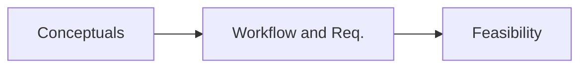

[[Blockchain]] for data [[Blockchain|CIA]] 
[[Edge Computing]] for low latency and compute resource requirements

Applications in IIoT 
Why do we need Edge computing here?
- Low latency
- Cost-efficiency
- Manageable in large geographical distributions with varying quality of access networks
- Autonomous and real-time operations

**Multi-access Edge Computing (MEC)** and 5G tech
Key measurable quantities:
1. Latency
2. Data Transfer Rates
3. Connection Reliability

**Where in the supply chain would the BlockEdge framework be useful**
1. Verification of Supply Material Origins
2. Conditions during transport and storage
3. Storage time
4. Mapping supply materials to end products
5. Monitoring the factory process
6. End product QA/QC and delivery

What does the paper present?

Existing solutions are **Dajie, SmartAxiom, Xage Security, Riddle and Code**, and **COSMOS**

