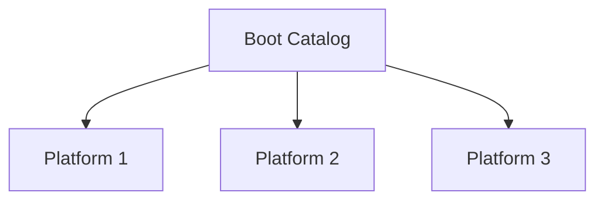

Standard for creating bootable media. It is an add-on to ISO 9660

**Starting-point** - Emulated floppy/Emulated HDD/Plain block address in ISO FS
### Structure
Boot structure begins with **boot record** at block address 0x11

Boot record -> **Boot Catalog** (`boot.catalog`)

**Platforms** are boot images. Multiple platforms can be housed in the boot catalog for multi-system architectures

|                                                                               **BIOS**                                                                                | **EFI**                                                                                                                                                                               |
| :-------------------------------------------------------------------------------------------------------------------------------------------------------------------: | ------------------------------------------------------------------------------------------------------------------------------------------------------------------------------------- |
| BIOS reads the number of blocks from the boot catalog and loads the blocks. Then, the code in the blocks is executed. The blocks are usually loaded to *segment 0c70* | EFI sees the boot image as a FAT filesystem and looks up a standardized file path. The boot file name depends on the processor type. Example: `/EFI/BOOT/BOOTX64.EFI` for x64 systems |
|                                         *Platform 0x00 = "80x86"* is used for BIOS in boot setups based on GRUB2 and ISOLINUX                                         | *Platform id 0xef* is used for EFI (as defined in the UEFI specification)                                                                                                             |

`Mkisofs` ccomposes the data for the boot catalog

The boot images of ISOLINUX and GRUB2 contain some information about the ISO filesystem and their own length and location. This is called the **Boot Info Table**, inserted by `Mkisofs`. *This is not specified by El-Torito but bootloader devs add this as a convention anyways*

### What if I'm booting with a USB stick?
El-Torito is only interpreted by the firmware if it's encapsulated in an optical medium. If the computer must detect a bootable USB stick, then it's important for the USB stick to have a **MBR** or **GPT**

### Sources 
1. https://wiki.osdev.org/El-Torito