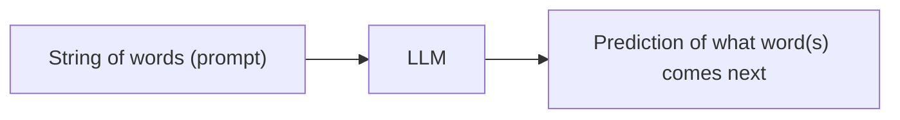

LLMs are essentially **prediction engines** 

The basic workflow of an LLM is as follows
1. Enter a prompt in the [[Context Window]]
2. Let the LLM process the prompt
3. The LLM generates its response to the prompt

| **Pre-training**                                                                                                      | **Fine-tuning**                                                                                                    | **Instruction-tuning**                                                                        |
| --------------------------------------------------------------------------------------------------------------------- | ------------------------------------------------------------------------------------------------------------------ | --------------------------------------------------------------------------------------------- |
| Initial training phase                                                                                                | Take already-trained LLM and train it further on more specific datasets                                            | New tech - Train models to follow instructions in prompts better                              |
| Broader and more generic understanding of several topics                                                              | Deeper understanding of specific topics and helps model cover for pointed scenarios that pre-training didn't cover | No new information added per se. Train model to better parse prompts and process instructions |
| Extreme computational expense -> huge datasets used for training --> <font style="color:red">Not for beginners</font> | Not as resource-intensive as pre-training (enhanced knowledge only on specific scenarios)                          | Presumably about as intensive as fine-tuning or less                                          |

The format below is usually used for **instruction tuning** because it is used to _aligning model outputs with specific instructions_ but it can also be used for **fine-tuning**
```
{'Instruction': "",
 'Input': "",
 'Output': ""}
```

**How does an LLM parse and process documents to improve its responses?** [[Retrieval-Augmented Generation (RAG)]]

* LLM Benchmarks
	* MMLU 
	* GPQA 
	* HumanEval
	* GSM-8K
	* MATH
	* Shot (0-shot, 5-shot, 8-shot etc)
	* CoT
* Transformer Architecture
* Tokenizer 
* Grouped Query Attention (GQA) 
* Self-attention (Mask)
* Data-filtering pipelines
	* Heuristic
	* NSFW
* Semantic Deduplication
* Text Classifier
* Chinchilla-optimal amount of training
* Parallelization
	* Data
	* Model
	* Pipeline
* Supervised fine-tuning (SFT)
* Proximal Policy Optimization (PPO)
* Direct Preference Optimization (DPO)