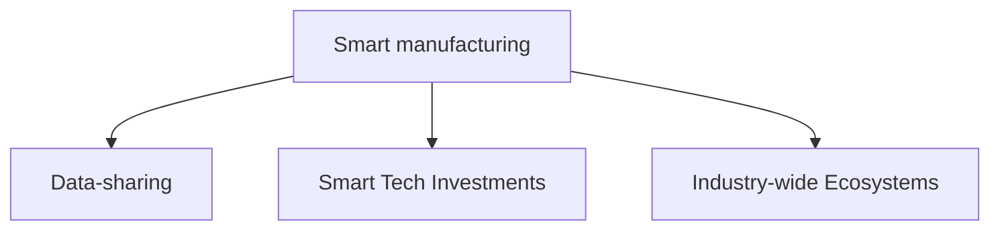

**Deloitte's 2021 Global Resilience Survey**  -> **66%** of industry leaders say that massive change, like COVID-19 will be a _regular experience_ from now on -- Gotta be prepared for the worst and for the ever-changing

**Deloitte's Digital Transformation Executive Survey** -> 
* 50% of IP&C leaders said "better insight of business and market -> digital transformation"
* 61% of respondents said "priority increased due to COVID-19"
* 38% -> creating more transparency
* 28% -> planning to create transparency

Focus industry: _Aerospace and Defense (A&D)_

Full potential of data-sharing and technology <- Industry-wide ecosystems
**Data Life Cycle** - Full arc from Engineering, to Manufacturing, to the aftermarket, and the components within 
- Monitoring the design process
- Digital Supply Chain
- System Health

The question is, _A&D industries have a lot of data on their hands. How to use it effectively?_

Use [[Digital Thread]] and Data Democratization -> uninhibited access to information to inform own processes and advance industry
There's a **problem** though! 
> 2020 MAPI-Deloitte survey - Privacy, IP, confidentiality, cybersec

Also, who owns the data? 

> 2019 MAPI-Deloitte survey - Connection b/w smart factory and business values

#### The Big 5 Technologies for A&D
1. IIoT
2. AI/ML
3. Automation
4. AR/VR
5. Additive Manufacturing (AM) -> Complicated for A&D though. Certification of AM materials is tedious and it's all limited to the shop floor

When inventing a new capability, **scaling** will be difficult 

>[!Summary]
>The network effect is of paramount importance in the A&D industry as the value of the ecosystem grows in direct proportion to the number of participants involved in it. How so? 
>
>The effect does not concern the customer base alone -- even the addition of manufacturers, R&D firms, and suppliers etc. can boost the net value of the industry
 
### Sources
1. https://www2.deloitte.com/us/en/insights/industry/aerospace-defense/advanced-manufacturing-aerospace.html