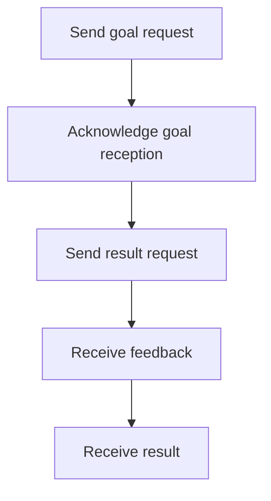

**Date:** 11-06-2024 18-44
**Tags:** #ros2 #robotics #programming
**Uplink:**

# ROS 2 Actions
>[!Definition]
>**Actions** are methods of communication which are similar to services but with different features 
>- Actions can be *cancelled anytime*
>- Actions provide *steady feedback*
>- Actions are good for *long-running tasks*

The following flowchart is how an **action** typically works like:

### Commands
- `ros2 node info <node_name>` - Lists nodes. Action servers and action clients are shown in the bottom
- `ros2 action list` - List all actions in ROS graph. `-t` for listing types as well
- `ros2 action info <action_name>` - Get info of action
- `ros2 interface show <action_type>` - Get structure of action type
	*First section* - Goal 
	*Second section* - Result 
	*Third section* - Feedback 
- `ros2 action send_goal <action_name> <action_type> <values>` - Send goal. `--feedback` gives continuous feedback
