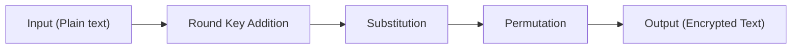

They are a series of **mathematical operations** used in encryption. They are also considered to be a type of **lightweight block ciphers**
* Smaller footprint
* Less computationally expensive
* Less energy consumed

SP networks are used in encryption algorithms such as AES

* **Round Key Addition** - The *round key* is a secret key that is XORed with the plain text. It serves to add a layer of encryption. Each round has a round key
* **Substitution** - Here, the characters of the XORed text are substituted with different characters based on specific rules set in the S block
	* **Avalanche Effect** - The output bit depends on the input bit. This is beneficial
* **Permutation** - Here, the characters are jumbled and reshuffled