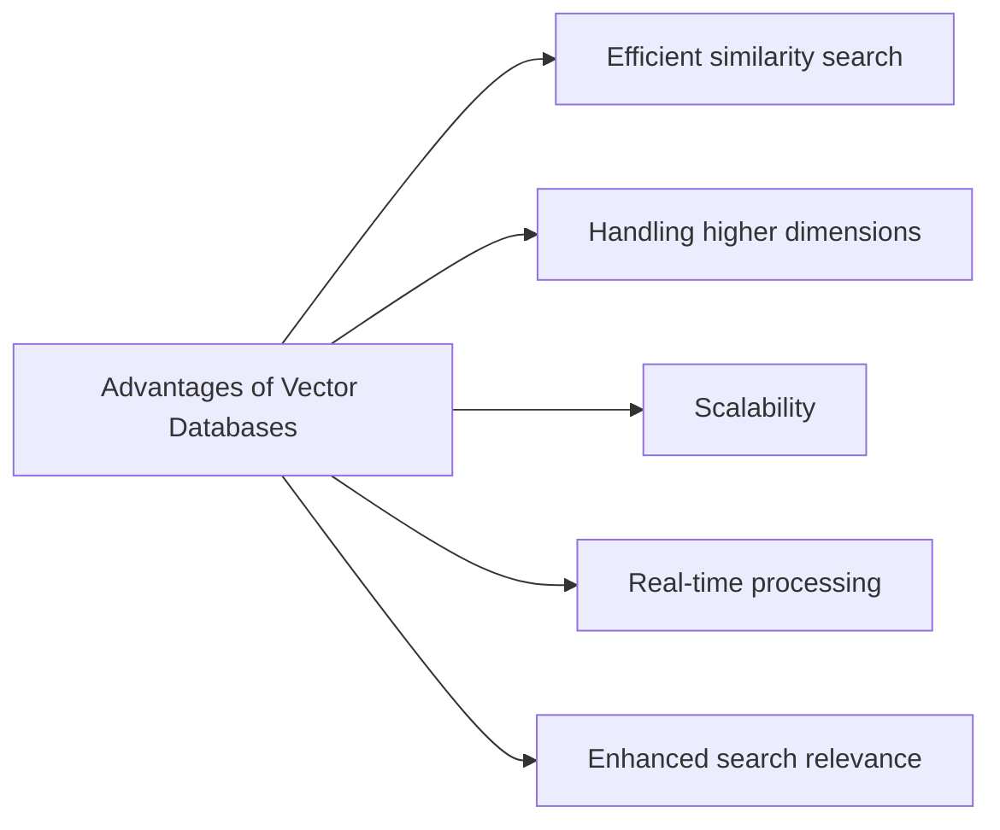

>[!Definition]
>A *vector database* is the numerical database/collection of all vectors produced by an [[Embedding Model]]

```mermaid
flowchart LR
	A["Advantages of Vector Databases"] --> B["Efficient similarity search"]
	A["Advantages of Vector Databases"] --> C["Handling higher dimensions"]
	A["Advantages of Vector Databases"] --> D["Scalability"]
	A["Advantages of Vector Databases"] --> E["Real-time processing"]
	A["Advantages of Vector Databases"] --> F["Enhanced search relevance"]
```
