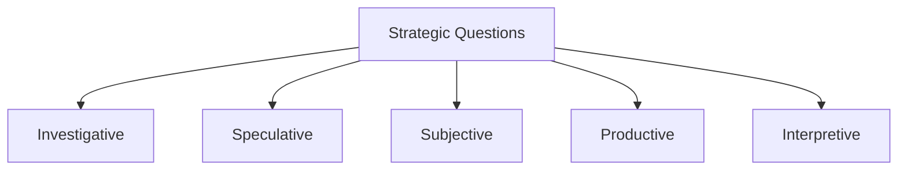

Ask questions (and the right ones)

In the age of AI, focus: answers ---> questions 

#### What is a framework for questions to ask in decision-making?
Questions that aren't asked much - **Gets teams and leaders into trouble**
* Ask questions to _make happen what otherwise wouldn't_
* Ask questions that _flush out info, insights, and alternatives_
* Ask questions that _unearth critical questions that have been overlooked_
You may be impeded by your own experience and success -> [[Einstellung Effect]]
* **Self-awareness and self-critique** is the key here

**Investigative** - What do we know? _Identify and analyze problem in depth_
**Speculative** - What if? What else? _Broaden the possibilities_
**Productive** - Now what? _Assess availability of resources, capabilities, time, and talent_
**Interpretive** - So, what? _To help make sense of things and to attack from multiple perspectives_
**Subjective** - What's unsaid? _Uncover personal reservations and frustrations_

**Pluralistic Ignorance** - Team members may fail to share misgivings simply because no one is sharing them

### External Links
- https://hbr.org/2024/05/the-art-of-asking-smarter-questions?ab=HP-magazine-text-1