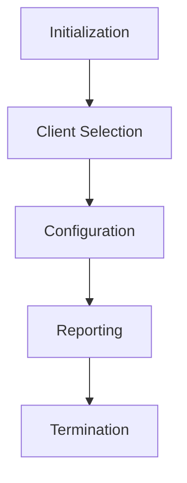

>[!Definition]
>A **subfield** of **machine learning** where **multiple units collaboratively train a model** while making sure that the **data remains decentralized**[^1]

In federated learning, there is **no guarantee** that the data spread across the agents are **independent and identically distributed (IID)** - **Data Heterogeneity**

**General idea** - Models are trained on **local data samples** and **model parameters** are exchanged across the agents

>[!info]
>The key difference b/w **federated learning** and **distributed learning** is that the former involves training models on **heterogeneous datasets** while the latter aims to **paralielize computing power**

**Goal** - All objective functions on all the nodes must **converge** at some point 
#### Types of Federated Learning
1. **Centralized** - The *allocation and assignment* of nodes and the *aggregation of received model updates* is handled by a single central node. ==Bottleneck issues==
2. **Decentralized** - All the nodes handle the aforementioned aspects themselves. The nodes are able to *coordinate with each other globally*. This ensures ==redundancy== but the entire performance of this is highly dependent on network topology 
3. **Heterogeneous** - *Different* nodes of *different computation power* and *communication abilities*. The aim is to unify them all and produce a *single globally accurate model*. ==HeteroFL== is a software framework for this

#### Process of Federated Learning 
In a single ==synchronous== **federated learning round**, the following happens in order
1. **Initialization** - An ML model is chosen and all nodes are *initialized* and *made ready* to wait for the start signal from the server
2. **Client Selection** - A *subset of all the nodes* are chosen for the training round. The chosen nodes receive the *model to train*
3. **Configuration** - The selected nodes receive *instructions* from the server to train the acquired models locally in a *pre-specified fashion*
4. **Reporting** - Once the nodes are *done locally training their models*, the model updates are reported back to the server. The server *aggregates the local models* to produce a *global model*. This is also where the server *accounts for disconnected nodes or errors w/ aggregation*. The next round *goes back to the client selection* phase
5. **Termination** - The round *terminates* when either *the max. number of iterations is exhausted*, a *consensus* is reached, or any other condition such as *accuracy satisfying a set threshold* is met

**Async FL** --> Split Learning

#### Non-IID data types
* **Covariate Shift** - Local nodes may store *examples* of a *different statistical distribution* than other nodes 
* **Prior Probability Shift** - Local nodes may store *labels* of a *different statistical distribution* than other nodes
* **Concept Drift** - *Same label* but *different features*
* **Concept Shift** - *Same features* but *different label* 
* **Unbalanced** - Huge difference in the *amount of data* in different nodes

[^1]: https://en.wikipedia.org/wiki/Federated_learning
#### Hyperparameters
##### Network Topology
The **topology** of the network of nodes can play an important role in federated learning. This is especially true in **decentralized networks** where nodes **locally send their model updates** to **other nodes** and **aggregation** is also done locally
- **Training time** can be reduced 
- **Computing costs** can be cut

##### FL Parameters
This is decided **after the topology is chosen**
