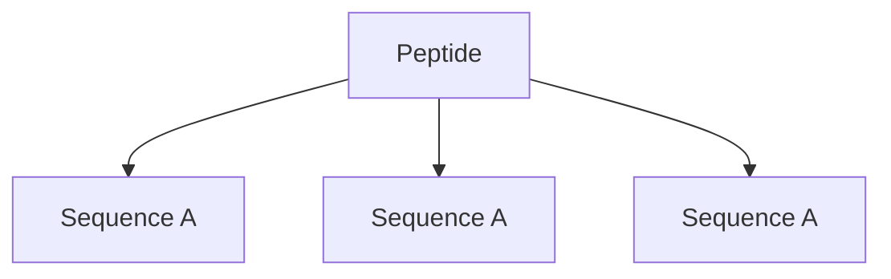
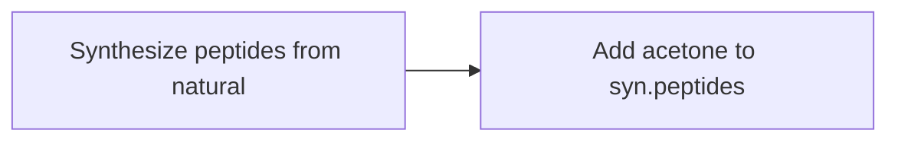

A system that involves its components/organisms spontaneously assembling themselves together to form complex structures _where the whole is greater than the sum_

Certain molecules and proteins can self-assemble

Self-assembly is _cost-effective_ and _environmentally sustainable_

### Applications
* Nanostructure manufacturing 
	* Therapeutics
	* Self-replicating machines
* Gene Therapy

The _Asian corn borer moth caterpillar_ has cuticles that harness self-assembling abilities. **NTU, Singapore** has used these properties to create nanosized capsules for drug and [[mRNA]] delivery 

The head cuticle of the caterpillar contains chains of amino acids called **peptides** -> self-assembly properties

Peptides with three or more repeating **sequences** and with each sequence containing _5 or more_ amino acids are screened. This property is crucial to self-assembly -- interactions between repeating components. _3 such peptides_ were found
Also, self-assembly happens due to _chemical concentration gradients_ 

#### Methodology

1. Upon adding acetone, the peptides formed droplets
2. Acetone diffused into droplets and water diffused out of the droplets -> concentration gradient created -> peptide self-assembly triggered
3. The peptides self-assemble into sheet-like structures called **beta sheets**
4. The beta sheets form spherical hollow nanocapsules
Fine-tune nanocapsule size by adjusting ratio of peptides and isophorone diisocyanate

#### Sources
1. https://phys.org/news/2024-04-scientists-caterpillars-capsules-drug-delivery.html